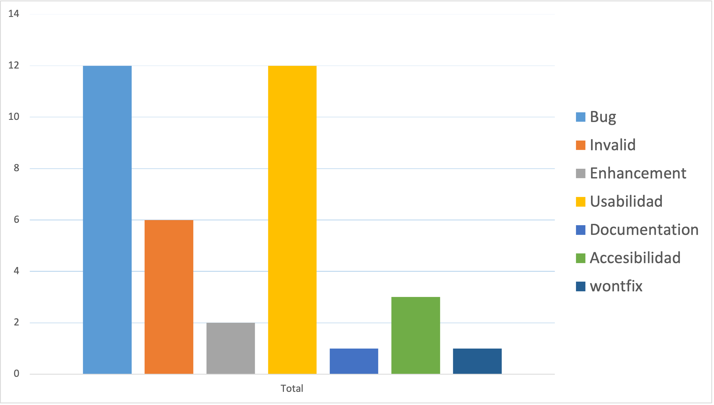

# Informe académico entrega 2

Proyecto: 202108 MisGastos  
Autores: Giovanni Olivieri (205237), Diego Urreta (238422)  
Grupo: N3A
Docentes: Gabriela Sánchez, Miguel Sánchez  
Repositorio Git: [Grupo 4 - Olivieri/Urreta](https://github.com/ORT-FIS-202108/proyecto-grupo-4-olivieri-urreta.git)  
Fecha Code Freeze: 22-nov-2021
Fecha de entrega: 29-nov-2021

## Construcción

### Implementación de funciones principales (sin la necesidad de persistencia de datos)

Para la implementación de las funciones de la aplicación se tomaron como punto de partida los requerimientos funcionales definidos en la primer entrega del obligatorio. De todos los requerimientos funcionales, sólo se trabajó en aquellos que era posible implementar con las herramientas y conocimientos actuales de ambos integrantes del equipo.

Se descartaron en esta etapa aquellos que implicaban una complejidad técnica elevada, gran cantidad de horas necesarias para implementar, o necesidad de aplicar herramientas no vistas en clase. Un ejemplo de esto, es la implementación de un servicio email en el servidor para enviar emails con recordatorios a los usuarios.

**Requerimientos implementados**
- RF01 - El sistema debe permitir crear una cuenta.
- RF02 - El sistema debe requerir usuario y contraseña para mostrar e ingresar gastos.
- RF03 - Los usuarios pueden registrar un gasto con descripción, precio y fecha.
- RF04 - El sistema debe implementar un calendario de pagos.
- RF07 - Los usuarios pueden configurar un gasto como recurrente.
- RF08 - Los usuarios pueden seleccionar una categoría de gasto para cada gasto ingresado.
- RF09 - El sistema permite visualizar un resumen de gastos por mes (gráficas, o listados).

**Requerimientos no implementados**
- RF05 - Los usuarios deben recibir recordatorios de pagos (e-mail).
- RF06 - Llevar un control de estado de cuenta bancario.
- RF10 - Los usuarios pueden compartir gastos entre ellos (verificar si es posible o si nos complicaría mucho).
- RF11 - Los usuarios pueden seleccionar una vista de listado o pie chart para los resúmenes de gastos.
- RF12 - El sistema muestra total en pesos y total en dólares si hay gastos ingresados en más de una moneda.

### Configuración de plataforma tecnológica para desarrollo y producción

Se crea la rama ```develop``` a partir de la rama ```main```, siendo la rama ```develop``` el punto de partida para todas las sub-ramas ```feature-*```.

Todo el trabajo de desarrollo de las distintas funciones de la aplicación se lleva a cabo en las distintas ramas ```feature-nombre```, donde ```nombre``` es el nombre de la función a desarrollar. Una vez que se completa el desarrollo de una función, se hace un merge con la rama ```develop```. 

Luego de finalizado el desarrollo de todas las funciones, se congela el código de las funciones y se hace un merge de la rama ```develop``` a la rama ```main```. A partir de este punto sólo se trabaja en el test de sistema, la documentación de issues y generación del informe académico. Para el trabajo en el test de sistema se crea la rama ```testing``` a partir de la rama ```main```; para el trabajo en la documentación de issues y generación del informe académico se crea la rama ```documentacion``` a partir de la rama ```main```.

Finalizadas las actividades de test de sistema, reporte de issues y generación del informe académico, se integran las ramas ```testing``` y ```documentacion``` a la rama ```main```.

*Agregar imagen de Git Graph con las ramas y commits*  

### Documentación del uso de librerías externas (package.json)

En el archivo _package.json_, bajo las secciones _devDependencies_ y _dependencies_, se pueden encontrar las siguientes dependencias que refieren a las librerías externas utilizadas durante el desarrollo del proyecto:

```
"devDependencies": {
    "eslint": "^8.2.0",
    "eslint-config-google": "^0.14.0",
    "jest": "^26.6.3"
  },
"dependencies": {
    "moment": "^2.29.1"
}
```

A continuación se describen brevementes las dependencias y para que se utilizó cada una de ellas.

**ESLint**

```
    "eslint": "^8.2.0",
    "eslint-config-google": "^0.14.0"
```

Es un analizador estático de código que se utilizó en los archivos Javascript para identificar errores de calidad o sintaxis en el código, evitar posibles bugs, y para escribir código que sea más mantenible.

Esta es fue una herramienta de gran importancia ya que ayudó a que el código sea más fácil de leer y entender por todos los integrantes del equipo facilitando la colaboración. 

En cuanto a la calidad del código, durante la instalación y configuración se seleccionó el estándar de Google como el conjunto de reglas a validar. 

En las sección _Codificación_ se brindan más detalles sobre el impacto de ESLint y el análisis estático del código.

**Jest**

```
    "jest": "^26.6.3"
```

Jest es un framework para testing que se utilizó para llevar a cabo las pruebas unitarias. En la sección _Test unitario_ se brindan más detalles sobre el proceso para ejecutar pruebas unitarias con Jest.

**Moment**

```
    "moment": "^2.29.1"
```

Moment es un framework para validar, formatear y mostrar fechas de una manera más fácil. Se utilizó para validar si las fechas ingresadas por interfaz cumplen con el formato válido y detectar errores.

## Interfaz de usuario

### Interfaz de usuario web / mobile (responsive).

La aplicación cuenta con una interfaz responsive que se ajusta al tamaño del dispositivo y/o browser, que ya estaba implementada en el framework base provisto.

De nuestra parte, al momento de diseñar y agregar los componentes se tuvo en cuenta que estos se ajustaran de manera que no interfirieran entre ellos y mantuviesen el sistema de diseño.

A continuación se muestran ejemplos de las diferentes secciones del sitio y su comportamiento responsive en diferentes dispositivos y tamaños.

**Web**

- Login page
  - Ventana grande
  
    

  - Ventana reducida
    
    

- Creación de gasto
  - Ventana grande

    

  - Ventana reducida

    

**Mobile**

- Android

    

- iOS

    

### Página única con navegación entre secciones

La aplicación se desarrollo en una sóla página (único archivo HTML), con diferentes secciones que dependiendo del input del usuario muestra u oculta las secciones necesarias.

El ejemplo más claro de esto es la sección de Login/Registro de Usario que se muestra al iniciar el sitio. Las secciones para mostrar e ingresar gastos, y otros componentes, no son visibles al iniciar el sitio. La única manera para que el usuario pueda visualizarlas es mediante el login correcto. De la misma manera, al ingresar con éxito al sitio la sección de Login/Registro de Usario queda oculta.

Para implementar esto desde el punto de vista del desarrollo, se utilizó el componente _tab-bar_ de Material para navegar entre las secciones, y sólo se muestran las tabs (y los contenidos de cada una) de aquellas secciones que pueden y deben accederse en un determinado momento. Por ejemplo, en la sección Login/Registro de Usario sólo se muestran la tab _Iniciar Sesión_ y la tab _Crear Usuario_, estando ocultas las tabs para _Gastos del Mes_ y _Agregar Gasto_.

La lógica para el comportamiendo de ocultar y mostrar secciones, al igual que la lógica para otros inputs del usuario, se codificaron en el archivo _index.js_ ya que es una responsabilidad de la interfaz.

### Implementación: Material Design Web Components

A continuación se detallan los componentes de Material Design utilizados para construir el sitio.

- material-theme con colores priario, secundario y de background.
- mdc-icons - Íconos de material design que se muestran en diferentes secciones/componentes del sitio.
- app-bar-top - Sección para ubicar nombre del sitio, botones para navegar entre meses y botón de logout.
- tab-bar - Sección para tabs de navegación entre secciones del sitio.
- tab-scroller - Hace posible hacer scroll en la tab bar, para mostrar tabs no visibles en caso de que el tamaño del browser/dispositivo no lo permita. 
- tab-indicator - Indicador de tab seleccionada.
- mdc-buttons - Botones para los form de login, registro de usuario, creación de usuario.
- icon-buttons - Botones para seleccion de mes, logout.
- mdc-list - Listado de gastos de un mes.
- mdc-list-group - Agrupa por día gastos de un mes.
- line-ripple - Efecto de click en lista gastos.
- text-fields - Campos de los forms de login, reistro usuario, registro gasto.

Si bien el objetivo era usar la mayor cantidad posible de componentes de Material Design, hubieron casos en que esto no fue posible debido a que no existe una implementación para web de determinados componentes. Por ejemplo, al momento no existe una implementación del Date Picker de Material para web, y por lo tanto se tuvo que utilizar un date picker de HTML básico.

### Aplicar un sistema de diseño y principios de usabilidad

**Sistema de Diseño**

Se utilizó el sistema de diseño [Material Design](https://material.io/) con sus respectivos componentes (botones, íconos, listas, etc.). Se siguieron los lineamientos y recomendaciones para la utilización de cada componente, que abarcan aspectos de diagramado, navegación, y usabilidad entre otros.

Al momento de implementar un nuevo componente se tuvieron en cuenta aspectos como anatomía, jerarquía, ubicación, y comportamiento, información que se puede encontrar (para cada tipo de componente) en el siguiente [link](https://material.io/components). Fueron de gran utilidad las secciones de _Do & Don't_ que se pueden encontrar en la documentación.

**Análisis Heursístico**

Se llevó a cabo un Análisis Heursístico para identificar fallas de usabilidad en la interfaz del sistema, comparando la interfaz y su funcionamiento con las 10 heurísticas de usabilidad de Jakob Nielsen.

Se evalúa el cumplimiento de cada una de las 10 heurísticas en todo el sitio, y en base al resultado del cumplimiento (total/parcial/no se cumple) se asigna un puntaje y se crean issues en caso de ser necesario.

A continuación se detalla el nivel cumplimiento para cada heurística, y se puede acceder al análisis completo en el documento [Evaluación de Usabilidad](../docs/usabilidad/Evaluacion_De_Usabilidad.xlsx).

1. Visibilidad del estado del sistema: Total
2. Adecuación entre el sistema y el mundo real: Parcial
3. Libertad y control por parte del usuario: No se cumple
4. Consistencia y estándares: Parcial
5. Prevención de errores: No se cumple
6. Reconocimiento antes que recuerdo: Parcial
7. Flexibilidad y eficiencia en el uso: Parcial
8. Diseño estético y minimalista: Total
9. Ayuda a los usuarios a reconocer, diagnosticar y recuperarse de los errores: Total
10. Ayuda y documentación: No se cumple

El resultado final de la evaluación da un total de 56 puntos y muestra que hay varias de las heurísticas que no se cumplen o se cumplen parcialmente. Por lo tanto se deberá trabajar en los issues generados durante esta evaluación y una ves cerrados se deberá volver a hacer la evaluación para validar de que se hayan resuelto las deficiencias de usabilidad.

### Cumplimiento de estándar de accesibilidad WCAG

Para la validación del cumplimiento del estándar de accessibilidad, se utilizó la herramienta del sitio [AChecker](https://achecker.achecks.ca/checker/index.php).

Esta herramienta permite subir un archivo (nuestro archivo index.html en este caso), y validar el cumplimiento de estándares de usabilidad. Al momento de validar el archivo se seleccionó el estándar _Web Content Accessibility Guidelines (WCAG), Version 2.0, Level AA_ que es el estándar seleccionado por defecto en el validador.


**Resultados**

La validación arrojó 28 errores separados en dos categorías:
- Adaptable: Create content that can be presented in different ways (for example simpler layout) without losing information or structure.
- Input Assistance: Help users avoid and correct mistakes.

Resumen del resultado:


Para ver un listado detallando cada error, puede acceder al siguiente archivo: [Listado errores](../docs/accesibilidad/resultados-accesibilidad.txt)

En base a los resultados obtenidos, se crearon en GitHub los issues correspondientes:
- Elementos input de tipo password sin label o sin texto en el atributo label: #44
- Elementos input de tipo text sin label o sin texto en el atributo label: #46
- Elementos input de tipo select sin label o sin texto en el atributo label: #47

### Seguir especificación de estilo

Se construyó el sitio siguiendo las especificaciones definidas en la letra para la letra, colores y tipos de íconos.

Tanto los colores como la fuente, fueron definidas en el archivo index.scss (líneas 1 a 5 y 37).

Para los íconos, al momento de seleccionarlos en la página de [Google Fonts](https://fonts.google.com/icons), se seleccionó el filtro 'filled'.

## Codificación

### IDE Visual Studio Code: configuración común del equipo

La configuración en común del equipo para el IDE, implicó la instalación de las extensiones ESLint y GitGraph.

La extension ESLint, se utilizó para integrar ESLint a VS Code y poder utilizar el linting de ESLint en el IDE.

La extension Git Graph permite ver de una manera fácil e intuitiva las diferentes ramas del repositorio (remoto y local), y ademas llevar a cabo otras acciones como el checkout, merge, y drop de ramas, creación de ramas y stashes, realizar code reviews desde el IDE cuando existen conflictos en un merge, y más.

### Estándares de codificación Google (HTML, CSS, JavaScript)

Para cumplir con los estándares de codificación se utilizaron herramientas de análisis estático de código, validadores online. A su vez, al momento de escribir el código se tuvieron en cuenta aspectos sobre nomenclatura de los elementos, indentado, utilización de mayúsculas y minúsculas, espaciado y agrupamiento de sentencias.

Se utilizaron como referencia y material de consulta las style guides de Google para  [HTML y CSS](https://google.github.io/styleguide/htmlcssguide.html) y [JavaScript](https://google.github.io/styleguide/jsguide.html).

Adicionalmente, luego de escrito el código se validaron los archivos HTML y CSS mediante el validador online [W3C](https://validator.w3.org/#validate_by_upload+with_options).

**HTML**
Al validar el archivo HTML con la herramienta online, en una primera validación, se obtubieron 19 errores y 10 advertencias (warnings). Ya que esta validación inicial fue antes del code freeze, fue posible hacer correcciones en el archivo, y luego de estas se llevó a cabo una segunda validación en la cual se redujeron los errores a 8 y los warnings a 6. 

Carga de archivo

  

Resultado segunda validación

  

**CSS**

La validación del archivo CSS no detectó errores.


**JavaScript**

En la sección sobre Análisis estático de código se aborda en detalle el estándar utilizado para los archivos JavaScript. 

### Buenas prácticas de OOP: separación de lógica e interfaz

Para aplicar buenas prácticas de OOP, se utilizaron archivos específicos para la lógica de la interfaz y otros para la lógica de negocio. Luego, todos los archivos relacionados con la lógica de negocio se ubicaron en la carpeta Dominio y los de la interfaz en la carpeta Interfaz.


Toda la lógica de la interfaz se codificó en el archivo index.js, donde las funciones que manejaran inputs y outputs de la interfaz se encargan de procesar la información ingresada por el usuario, y luego en caso de ser necesario solicitar la información al dominio.

El único punto de entrada para el Dominio es la clase Sistema, a la cual la interfaz le solicita la información. Despues la clase Sistema se encarga de encontrar la información, dentro de la misma clase o pidiendose la a las clases Usuario o Gasto.

Todas las funciones dentro de las clases Usuario o Gasto se encargan de procesar o encontrar información exclusivamente de objetos que pertenezcan a la clase.

**Sistema**


**Usuario**


**Gasto**


### Análisis estático de código: mostrar reducción de problemas

Para el análisis estático de código se utilizó ESLint y su respectiva extensión para Visual Studio Code. Esta herramienta permitieron detectar en tiempo real potenciales errores de calidad o sintaxis en el código, o código que no se ajustaba a el estándar de codificación de Google para JavaScript. 

ESLint nos ayudó a escribir un código fácilmente mantenible y de mejor calidad. Se detallan a continuación algunos ejemplos de cómo se pudo mejorar el código y se redujeron la cantidad de problemas.

**JSDocs**

ESLint nos ayudo a desde un comienzo del proyecto a codificar las funciones con su respectivo JSDoc para poder obtener detalles de ellas independientemente desde donde se invocara la función. Además, nos permitió identificar errores en las firmas de las funciones cuando los parámetros no eran correctos.

_Función sin JSDoc_


_Función con JSDoc - Sin parámetros_


_Función con JSDoc - Con parámetros_


_Función con JSDoc incorrecto - Antes_


_Función con JSDoc incorrecto - Después_


**Espaciado**

ESLint nos permitió remover espacios que no se ajustaban a el estándar o que podrían dificultar la legibilidad del código.

_Indentación incorrecta (mas de 2 espacios por tab)_


Esto nos permitió identificar que la configuración del IDE para los espacios era incorrecta. Se procedió a cambiar la configuración del espaciado a 2 espacios por tab.

_Espacios innecesarios al final de las líneas_


_Espacios entre llaves y texto - Antes_


_Espacios entre llaves y texto - Después_


**Variables e Imports**

En este aspecto ESLint fue de utilidad para identificar problemas realcionados con la utilización de variables e imports. Por ejemplo, si una variable se creaba y nunca se utilizaba, o lo mismo para un import. Otro ejemplo es la utilización de const para las variables que se creaban y nunca cambiaba su valor.

_Variable no reasignada_


_Import no utilizado_


**Comillas**

En los archivos js se utilizaron exclusivamente commillas simples (single quotes) de acuerdo a lo establecido en la style guide de Google. Al comenzar a trabajar utilizamos comillas dobles, pero ESLint rápidamente nos ayudo a acostumbrarnos a usar single quotes.


## Test unitario

### Test unitarios en Jest

De acuerdo a lo establecido en la letra, durante la etapa de desarrollo llevamos a cabo varias instancias de pruebas unitarias para funciones de las clases del Dominio. El objetivo principal fue llegar a una cobertura del 100% de las clases del Dominio, para lo cual se crearon tests que cubrieran la totalidad de ramas, sentencias, funciones y líneas.

La manera que abordamos esta tarea fue enfocarnos en crear los tests para cada clase del Dominio con la mayor granularidad posible. Cada clase cuenta su respectivo archivo nombre-clase.test.js donde se codificaron tests para cada función y sus diferentes inputs y outputs. En estos archivos utilizamos el método global _describe_ que se utilizó para agrupar tests que se ecargan de probar una misma funcón pero para diferentes casos de prueba.

Una vez codificados los tests, ejecutamos las pruebas desde la consola y verificamos los resultados. Si la cobertura de test (coverage) no era la esperada, se procedía a hacer ajustes a las pruebas.

Cuando finalmente se consiguió la cobertura deseada, nos encargamos de trabajar en las pruebas y en las funciones de la clase en sí hasta que la mayor cantidad posible tuviesen un status: passed.

### 100% cobertura en clases de dominio

En total se crearon 49 tests diferentes para todas las clases del Dominio, y estos tests cubren en un 100% las sentencias, ramas, funciones y lineas de todas las clases del Dominio. No se observan líneas no cubiertas.


## Test de sistema

### Realizar test de sistema sobre la versión congelada

Todos los tests, planificados y exploratorios, fueron llevados a cabo sobre la última versión de la aplicación que fue integrada a la rama main en el commit ```8f52c9fb``` del 22 de noviembre.

Para ejecutar los tests se creó la rama testing a partir de la rama main en ese commit. La rama testing no fue modificada con exepción de aspectos relacionados a la documentación de las pruebas. No se realizaron cambios en el código de ningún tipo.

### Ambiente de testing independiente del desarrollo

Como se menciona en el punto anterior, luego del code freeze se creó una rama de testing a partir de la rama main donde se encontraban los últimos cambios de desarrollo (rama develop). A partir de este punto, todas las actividades de testing se realizan en esta rama que es independiente de la rama develop.


### Generar casos de prueba aplicando técnica partición equivalente

Se llevaron a cabo sets de pruebas planificadas para los diferentes casos de uso definidos en la primer entrega. El tipo de prueba utilizado fue el de _Caja Negra - Partición de Equivalencia_.

Para cada caso de uso, utilizando la tecnica de partición equivalente se definieron las diferentes clases de equivalencia como se detalla en este [documento](../docs/test-de-sistema/test-planificado/caja-negra/Clases%20de%20equivalencia.xlsx). Esta técnica consiste en crear clases de inputs de acuerdo al comportamiento que esperamos de ellos.

En total se ejutaron las pruebas para 6 casos de usos, con los casos de prueba para cada clase de equivalencia.

### Detallar sesiones de prueba exploratoria

Se llevaron a cabo dos sesiones de pruebas exploratorias (una por cada integrante del equipo). Estas pruebas consistieron en definir una misión y durante una sesión de prueba con un tiempo acotado, realizar la exploración tomando notas de eventos relevantes (defectos encontrados, inconvenientes, aspectos a mejorar, aprendizajes, riesgos).

Debido a la dimensión de nuestra aplicación consideramos que incluso una sesión de prueba corta, que requieren una duración de 30 minutos, era demasiado larga. Por lo tanto, decidimos hacer sesiones cortas pero acotadas a una duración de 20 minutos.

A continuación se encuentran los links a los documentos de cada sesión de prueba:
- [Prueba exploratoria #1](../docs/test-de-sistema/testing-exploratorio/#1-Giovanni-Olivieri-Testing-Exploratorio.pdf)
- [Prueba exploratoria #2](../docs/test-de-sistema/testing-exploratorio/#2-Diego-Urreta-Testing-Exploratorio.pdf)

## Reporte de issues

### Reportar issues (bugs, improvements, missing features) en GitHub 

A partir de las actividades de testing y evaluaciones de usabilidad y accesibilidad, se identificaron diferentes issues, improvements y missing features, que fueron documentadas en GitHub en la [sección de issues del proyecto](https://github.com/ORT-FIS-202108/proyecto-grupo-4-olivieri-urreta/issues).

Sumado a esto, durante la etapa de desarrollo se fueron identificando problemas a resolver o funcionalidades que no serían implementadas en esta etapa. Para todos estos se fueron creando sus respectivos issues y en caso de que fueran posteriormente resultos, fueron cerrados detallando el cómo y cuando.

### Aplicar buenas prácticas de reporte de issues

Para el reporte de issues se siguieron las buenas prácticas aprendidas en clase. Todos los issues de nuestro proyecto debían crearse con al menos estos puntos completos:

- Un título claro y que comunice las características básicas del problema a resolver. (Siempre tiene que completarse)
- Una descripción clara y detallada del contexto del problema y el efecto que este tiene sobre la aplicación. (Siempre tiene que completarse)
- La plataforma donde se observa el problema. (Opcional si es un probelma que no esta afectando)
- La severidad del problema para saber con que gravedad afecta a la aplicación. (Siempre tiene que completarse)
- La prioridad de resolución del problema para saber con que urgencia se debe resolver y que tantos recursos se deben utilizar. (Siempre tiene que completarse)
- Pasos detallados para reproducir el problema. (Opcional en caso de que no sea un issue y sea una funcionalidad a implementar)
- Agregar labels para categorizar el tipo de issue. (Siempre tiene que completarse)

### Definir labels para tipos de issue y niveles de severidad

**Labels**

Para la categorización de issues se utilizaron las labels predeterminadas de GitHub y se agregaron algunas que nos parecieron importantes para diferenciar algunos tipos de issues, como por ejemplo issues relacionados con usabilidad y accesibilidad.

Este un listado de las labels utilizadas:
- Accesibilidad
- Bug
- Documentation
- Duplicate
- Enhancement
- Invalid
- Question
- Testing
- Usabilidad
- Wontfix

En el siguiente [link](https://github.com/ORT-FIS-202108/proyecto-grupo-4-olivieri-urreta/issues/labels) se puede acceder a la lista de issues y su breve descripción.

**Severidad**

Se optó por la utilización de los tres niveles de severidad que se describen a continuación:

  - Alta - Problemas que impiden el funcionamiento de las funcionalidades base del sistema. (Funciones para Iniciar Sesión, Registrar Usuario, Recuperar Contraseña, Agregar/Editar/Borrar Gasto).
  - Media - Problemas en navegación de la interfaz, deficiencias de usabilidad, y requerimientos funcionales no implementados. (Visualización de gráfico de gastos por categorías, Mostrar total del mes).
  - Baja - Problemas de diseño y defectos visuales que no afectan las funciones y/o usabilidad del sistema. También funcionalidades extras a implementar. (Creación de gastos en multiples divisas, compartir gasto, envío de recordatorios por email)

**Prioridad**

Para la prioridad se crearon los tres niveles vistos a continuación:

- Crítica - Se debe resolver lo más pronto posible. Se detiene el desarrollo en otras áreas para resolver este problema.
- Media -  Se debe resolver antes del próximo release.
- Baja - Se puede posponer para otro release. Se resulve si hay tiempo.

### Dejar issues abiertos para correcciones o mejoras futuras

Debajo se detallan los issues que quedaron abiertos para futuras actualizaciónes:
  
- #17 - Link para recuperar contraseña de la página login. Tags: bug, invalid.
- #22 - Separar pagina de login del home. Tags: invalid.
- #24 - Implementar boton compartir gasto. Tags: wontfix.
- #25 - Mensajes de información y error inconsistentes con estilo general del sitio Tags: enhancement.
- #30 - Implementar gastos en varias divisas. Tags: enhancement.
- #34 - E-mail confirmacion de cuenta no enviado. Tags: invalid.
- #35 - Botón de logout no ofrece opción para confirmar/cancelar. Tags: bug,usabilidad.
- #36 - Form del login retiene usuario y contraseña luego de hacer login y logout. Tags: bug.
- #37 - Navegación con atajos (teclas tab o flechas) en algunos casos no muestra que elemento tiene el foco. Tags: bug, usabilidad.
- #38 - Botón de logout sin tooltip o label para identificarlo de manera clara. Tags: bug, usabilidad.
- #39 - Editar gasto no implementado. Tags: usabilidad.
- #40 - Eliminar gasto no implementado. Tags: usabilidad.
- #41 - Creación de manual de usuario. Tags: documentation, usabilidad.
- #42 - Filtrar gastos no permite ingresar un periodo deseado. Tags: invalid, usabilidad.
- #43 - El sistema no muestra el total gastado en el periodo seleccionado. Tags: invalid, usabilidad.
- #44 - Elementos en HTML de tipo password sin labels o sin texto en el atributo label. Tags: accesibilidad, bug.
- #45 - Filtrar gastos no permite ingresar una categoría deseada. Tags: invalid, usabilidad.
- #46 - Elementos en HTML de tipo text sin labels o sin texto en el atributo label. Tags: accesibilidad, bug.
- #47 - Elementos en HTML de tipo select sin labels o sin texto en el atributo label. Tags: accesibilidad, bug.
- #48 - Calendario para selección de fecha en crear gasto se muestra lejos de donde se hace click. Tags: but, usabilidad.
- #49 - Campos categoría y repetir del form Crear Gasto no se muestran del mismo largo que el resto de los campos. Tags: bugs, usabilidad.
- #50 - Selects del form crear gasto se muestran justificados hacia la derecha en Microsoft Edge. Tags: bugs, usabilidad.
- #51 - Listado de gastos no se muestra con el estilo predeterminado de las listas de Material. Tags: bug.

De todos estos issues se resolverán en orden de severidad (de mayor a menor) y a su vez por orden de prioridad (de mayo a menor).

### Sumarizar número de issues reportados por tipo

Los issues creados se dividen en las distintas categorias como se muestra en la lista y gráfica debajo:

- bug: 12
- usabilidad: 12
- invalid: 6
- accesibilidad: 3
- enhancement: 2
- documentation: 1
- wontfix: 1



### Realizar una evaluación global de la calidad

Con todas las etapas del proyecto finalizadas, podemos llevar a cabo una evaluación global de la calidad del producto final. Durante esta evaluación se toman en cuenta aspectos de calidad de la interfaz de la aplicación (usabilidad y accesibilidad), el cumplimiento de estándares y buenas prácticas durante la construcción, la cobertura de las pruebas unitarias, los resultados del test de sistema (pruebas planificadas y no planificadas), y los issues que quedaron sin resolver.

**Usabilidad**

El Análisis Heurístio realizado dio como resultado que tan sólo 3 de las 10 heurísticas de Nielsen se cumplen totalmente. Si bien queda bastante trabajo por delante para que todas las heurísticas se cumplan totalmente, ya se dieron los primeros paso para mejorar esta situación.

Para cada heurística que se identificó un cumplimiento parcial o incumplimiento, ya se crearon los respectivos issues en GitHub para resolver el problema. Estos issues cuentan con un nivel de severidad y prioridad que ayudarán a ir seleccionando cuales issues resolver primero, en la medida que el euipo se libere y cuente con el tiempo necesario.

Nuestra percepción de la usabilidad de la apliación es media, ya que se cumplió aproximadamente un 60% de los objetivos de usabilidad que teníamos.

**Accesibilidad**

La evaluación de accessibilidad devolvió resultados bastante positivos, ya que el análisis arrojó algunos errores de fácil solución. Todos los issues están relacionados a las lables de los componentes de HTML, y ya fueron documentados en sus respectivos issues en GitHub.

**Estándares de Codificación y Buenas Prácticas de OOP**

Este es otro aspecto en cual consideramos que se obtuvieron buenos resultados. Gracias a la utilización de herramientas de análisis estático del código y validadores online, fue posible asegurarse de que el código cumplía con los estándares seleccionados para el proyecto.

En cuanto a las buenas prácticas de Programación Orientada a Objetos, al momento de diseñar la aplicación pusimos mucho foco en mantener una separación clara del Dominio y la Interfaz, de manera que las responsabilidades estuviesen claramente identificadas y no hubiesen casos en los que una clase o la interfaz accediera a información que no correspondía.

En resumen, consideramos que en este aspecto la calidad es buena y se alcanzaron los objetivos que nos propusimos.

**Pruebas Unitarias**

Se logró una cobertura del 100% de las clases del Dominio, igual al objetivo propuesto en la letra. Esto se pudo lograr en parte gracias a que trabajamos con el framework Jest que hace muy fácil la creación de tests unitarios y ayuda a conseguir la cobertura de código deseada. 

Otro punto clave para obtener el 100% de cobertura, fue trabajar desde etapas tempranas del proyecto en las pruebas unitarias. Cada vez que comenzamos a trabajar en una funcionalidad nueva, unos de los primeros pasos era crear los tests unitarios en jest con diferentes casos de prueba, para luego comenzar a desarrollar la funcionalidad en sí.

Sumado a una cobertura del 100%, todas las pruebas ejecutadas de todas las clases dieron como resultado PASSED. Esto significa que tanto las funcionalidades críticas del Dominio como las menos importantes funcionan de manera correcta.

En conclusión, el resultado de la calidad de las pruebas unitarias es bueno.

**Test de Sistema**

Luego del code freeze nos enfocamos en trabjar en las pruebas de sistema. Se realizaron pruebas planificadas (Test de Caja Negra - Partición de Equialencias) y pruebas no planificadas (Pruebas Exploratorias). Ambos tipos de prueba fueron completados exitosamente, ya que ambas descubrieron issues que no estaban reportados aún.

Con respecto a las pruebas de Caja Negra, de todos los 29 casos de prueba diseñados, sólo 21 puedieron ser ejecutados ya que 8 de los casos de prueba eran para probar funciones que no fueron implementadas en esta etapa del proyecto.

El resultado del Test de Sistema es bueno ya que se descubrieron varios issues en ambos tipos de pruebas gracias a la cantidad de tiempo dedicada a las pruebas (aproximadamente 3 días en total). Es importnte tener en cuenta que esto significa que se descubrireron issues de cosas que no están funcionando de la manera esperada o que existe potencial para mejorar la aplicación, por lo tanto la calidad global de la aplicación se verá afectada.

**Issues sin resolver**

En casi todas las etapas mencionadas anteriormente, se descubrieron issues o cosas a mejorar. Esto implicó la creación de varios issues postrirmente al code freeze. Antes del code freeze se habían creado issues y algunos de ellos incluso fueron cerrados, pero son pocos en comparación con el total de issues del proyecto.


De todos los issues con estado 'Open' podemos observar que la mayor cantidad de issues son de severidad Media (amarillo) o Baja (verde).


Y si nos fijamos cuales son las funcionalidades más afectadas vemos que la creación de gastos es la más afectada por issues, seguida por las funciones de login, listar gasto y funciones de la interfaz (problemas generales de la interfaz no especificos a una sola funcionalidad).


Vemos que Creación Gasto, Interfaz, Login y Listado Gasto son las funciones con mayor cantidad de issues, entonces analizamos para esas cuatro funcionalidades la severidad de estos issues y se obsevó lo siguiente.


Por último si analizamos las categorías de los issues podemos ver que usabilidad es la categoría con mayor cantidad de issues.


**Conclusión de la evaluación global de la calidad**

En base a los puntos mencionados anteriormente podemos conluír que aún queda bastante trabajo para que la aplicación alcance un nivel de excelencia en lo que respecta a la calidad global. 

Esto se debe a la gran cantidad de issues de que afectan a la función Agregar Gasto y a Listar Gastos, dos funciones sumamente críticas para la aplicación. Si bien esos issues son de severidad baja y media, afectan aspectos claves como la usabilidad.

Sumado a lo anterior se observan varios issues vinculados a usabilidad en otras partes de la aplicación, haciendo que en general la usabilidad no sea aceptable. Esto quedó en evidencia durante la evaluación heurística que arrojó un resultado de 56 puntos sobre 100.

En resumen, si tuvieramos que dar un puntaje del 1 al 10 a la calidad global consideramos que el puntaje actual es un 7. En general la aplicación cumple las funciones básicas sin fallas críticas que detengan su funcionamiento, pero se identificaron varias mejoras para hacerle. A pesar de esas mejoras a hacer, consideramos que un puntaje de 7 es adecuado ya que están identificadas las mejoras a hacer y pueden abordarse de manera inmediata.

Desde nuestro punto de vista, previo al release deberían sí o sí resolverse los siguientes issues:
- Issues de las funciones Crear Gasto y Listar Gasto, principalmente los de Severidad alta y media.
- Issues de usabilidad y efectuar una nueva evaluación heurística.

El resto de los issues no incluídos en la lista anterior pueden resolverse teniendo en cuenta sus Severidades y Prioridades.

## Reflexión

Haber trabajado en este proyecto desde cero, cambió significativamente nuestras perspectivas de lo que implica el proceso de desarrollo de software. Nos ayudó a comprender que no solo escribir código es importante para entregar software de calidad y que cumpla con las expectativas de los usuarios. También nos resultó evidente el rol clave que juegan las etapas inciales del proyecto para disminuir el trabajo innecesario en etapas posteriores.

El curso nos parecio muy bueno ya que nos permitio crear soluciones eficientes y eficaces, profesionalizando el desarollo del software. Transformando una idea a una solución informatica de una manera organizada. 

### Detalle del trabajo individual

Si bien trabajamos juntos en varias oportunidades(videollamadas o reuniones) o verificamos el trabajo que realizaba el otro, siguen debajo el detalle individual de cada participante. 

Giovanni Olivieri

- HTML, CSS y JS (funciónes de login page).
- Implementación del formulario de crear gasto y sus funciones.
- Correción/Implementación de funciones de home page.
- Test Unitarios de las funciones creadas.
- Test de caja negra.
- Test exploratorio.
- Reporte de issues, sumarización de issues y gráfica.
- Documentación.

Diego Urreta

- HTML, CSS y JS (funciones de home page).
- Implementación del resumen de gastos y sus funciones.
- Correción/Implementación de funciones login page.
- Test Unitarios de las funciones creadas.
- Evaluación de calidad
- Test exploratorio.
- Reporte de issues.
- Evaluación global de calidad. 
- Documentación.


### Técnicas aplicadas y aprendizajes

Las técnicas aplicaciadas y aprendizajes que nos deja el curso son las detalladas debajo.

- Correcto uso de GitHub, lo que incluye un eficiente manejo de ramas, versiones y reporte de issues.
- Requerimientos: Correcta validación de requerimientos aplicando sus tecnicas correspondientes y también sus correspondientes herramientas para válidaras.  
- Desarollo de una página web (HTML, CSS y JS) en conjunto con NodeJs. 
- Test Unitario: Jest , herramienta muy potente que nos permite analizar la correcta funcionalidad de nuestro código sin dejar ningúna linea sin verificar. 
- Calidad del código, aprendimos la importancia de producir software de cálidad para que el mismo sea reutilizable y entendible respetando sus correspondientes estandares. 
- Testing: Las distintas tecnicas vistas en el curso (test de caja blanca, negra y exploratorio) fueron de mucha utilizadad para encontrar issues en nuestro sistema que en caso de que el mismo no hubiese sido testeado correctamente afectaria negativamente la persepción de nuestros clientes hacia nuestro producto, pudiendo evitar muchos errores a corregir antes de lanzar una aplicación o nueva versión de la misma. 